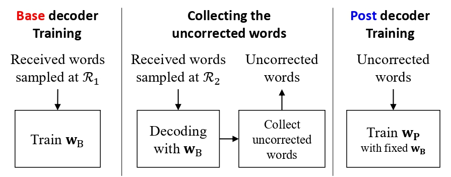

# Boosting learning for LDPC codes

Implementation of boosting learning for LDPC codes described in ["Boosting Learning for LDPC Codes to Improve the Error-Floor Performance (NeurIPS 2023)"](https://arxiv.org/abs/2310.07194) and ["Boosted Neural Decoders: Achieving Extreme Reliability of LDPC Codes for 6G Networks"] (https://arxiv.org/abs/2405.13413).

## Abstract (NeurIPS)

Low-density parity-check (LDPC) codes have been successfully commercialized in communication systems due to their strong error correction capabilities and simple decoding process. However, the error-floor phenomenon of LDPC codes, in which the error rate stops decreasing rapidly at a certain level, presents challenges for achieving extremely low error rates and deploying LDPC codes in scenarios de- manding ultra-high reliability. In this work, we propose training methods for neural min-sum (NMS) decoders to eliminate the error-floor effect. First, by leveraging the boosting learning technique of ensemble networks, we divide the decoding network into two neural decoders and train the post decoder to be specialized for uncorrected words that the first decoder fails to correct. Secondly, to address the vanishing gradient issue in training, we introduce a block-wise training schedule that locally trains a block of weights while retraining the preceding block. Lastly, we show that assigning different weights to unsatisfied check nodes effectively low- ers the error-floor with a minimal number of weights. By applying these training methods to standard LDPC codes, we achieve the best error-floor performance com- pared to other decoding methods. The proposed NMS decoder, optimized solely through novel training methods without additional modules, can be integrated into existing LDPC decoders without incurring extra hardware costs. The source code is available at https://github.com/ghy1228/LDPC_Error_Floor.

## Abstract (JSAC)
Ensuring extremely high reliability is essential for channel coding in 6G networks. The next-generation of ultra-reliable and low-latency communications (xURLLC) scenario within 6G networks requires frame error rate (FER) below $10^{-9}$. However, low-density parity-check (LDPC) codes, the standard in 5G new radio (NR), encounter a challenge known as the error floor phenomenon, which hinders to achieve such low rates. To tackle this problem, we introduce an innovative solution: boosted neural min-sum (NMS) decoder. This decoder operates identically to conventional NMS decoders, but is trained by novel training methods including: i) boosting learning with uncorrected vectors, ii) block-wise training schedule to address the vanishing gradient issue, iii) dynamic weight sharing to minimize the number of trainable weights, iv) transfer learning to reduce the required sample count, and v) data augmentation to expedite the sampling process. Leveraging these training strategies, the boosted NMS decoder achieves the state-of-the art performance in reducing the error floor as well as superior waterfall performance. Remarkably, we fulfill the 6G xURLLC requirement for 5G LDPC codes without a severe error floor. Additionally, the boosted NMS decoder, once its weights are trained, can perform decoding without additional modules, making it highly practical for immediate application. https://github.com/ghy1228/LDPC_Error_Floor}

## Implementation Enviroment

- NVIDIA RTX 2080Ti  
- Python = 3.6  
- Cudatoolkit=10.0  
- cudnn=7.6.5  
- tensorflow=2.4.0  

## Script

python main.py

## Acknowledgements
This project builds upon the implementations from the Neural Protograph LDPC Decoding project by KyrieTan. https://github.com/KyrieTan/Neural-Protograph-LDPC-Decoding 
Portions of our code are based on or adapted from this original repository. We thank the contributors of that project for their valuable insights and contributions to the open-source community.
    
## License
This repo is MIT licensed.
